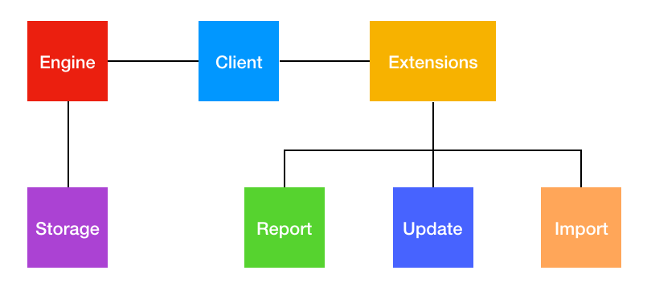

</img>

# Prudent

Prudent is an integrated environment that helps you automate and make sense of your personal and family ledger. Get clarity on your choices, optimize your financials!

More user-level info on the [Prudent website](https://prudent.me).

## Development approach

While Prudent is available as a [completely packaged client](https://github.com/PrudentMe/main/releases), it is actually developed as a decomposed set of components. You can develop addons, extensions and replacements for any of the software components that make up Prudent or use any of these components with other software.

## Architecture

Prudent's architecture is as follows:

## Components

| Component                | Description                                                        |
|--------------------------|--------------------------------------------------------------------|
| Client                   | The client application that interfaces the user to the various Prudent components. Also provides bootstrapping services of the engine and extensions while serving as the passthrough interface in between these components
| Report                   | Report extensions provide reporting functionalities by supplying view and summary data based on responses from the engine
| Update                   | Update extensions provide updated data such as market, commodity, stock or currency prices
| Import                   | Import extensions parses input transaction files and returns a JSON representation of those transactions
| Engine                   | Processes storage data and responds to queries on data from other components
| Storage                  | Stores transactions, configuration and other data

## Resources

These are the currently available resources, mostly interesting for developers interested in making import extensions:

* [Encode messages using Prudent's protocol (for communicating between add-ons and Prudent)](https://github.com/PrudentMe/addons-framework-encode)
* [Starting point for Prudent XLSX import add-on creators](https://github.com/PrudentMe/xlsx-import)
* [Starting point for Prudent text/CSV import add-on creators ](https://github.com/PrudentMe/text-import)
* [Starting point for Prudent update add-on creators](https://github.com/PrudentMe/update)
* [Prudent extension that parses qif files](https://github.com/PrudentMe/qif)

Development documentation (for import extension) is [available here](https://docs.prudent.me/docs/dev/creating_ext).

More documentation on the actual protocols and coverage of other components will be made available once it's ready.

## Request for an import or update extension

You can also request for extensions here in this repository. If there's a bank CSV or PDF that you wish you can import via Prudent that's still not available. Just create an Issue :)